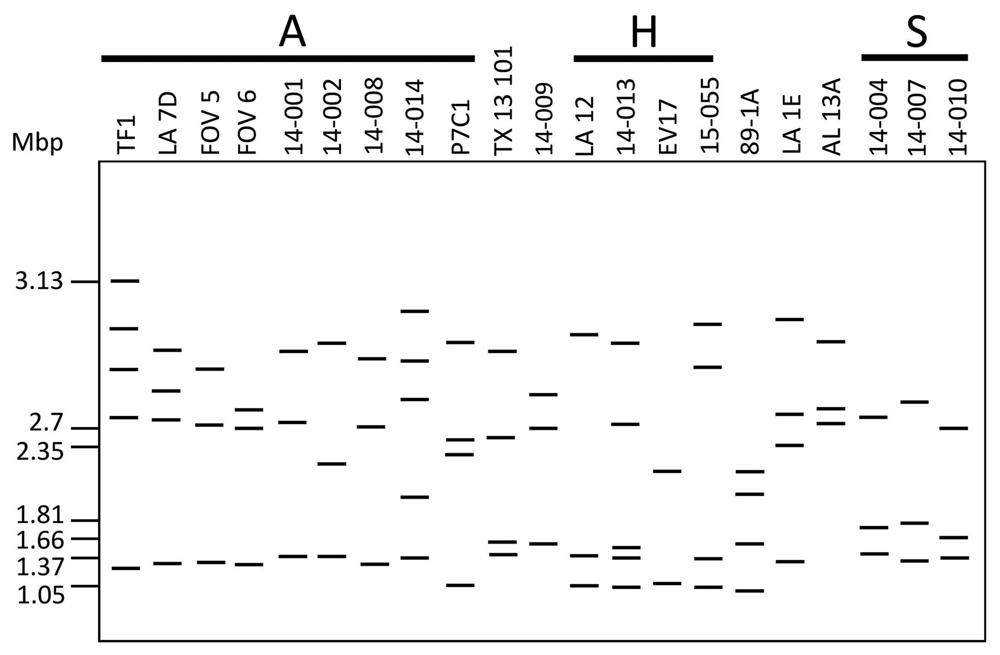

# Abstract

Members of the *Fusarium oxysporum* species complex are known to harbor accessory chromosomes that play critical roles in virulence and host adaptation. These chromosomes have the ability to be horizontally transferable between fungal isolates, posing a potential threat due to the spread of pathogenic traits.

In this study, we investigated a highly virulent *Fusarium oxysporum* f. sp. *vasinfectum* (Fov) strain, 89-1A, and identified a unique accessory chromosome containing a gene cluster that encodes a lactamase which has been confirmed to be a virulence factor for cotton.

A GFP tag was introduced into this chromosome, and two single-spore isolates carrying the GFP-tagged chromosome were obtained. A hydroponic test tube virulence assay confirmed the GFP insertion did not affect the virulence of strain 89-1A.

Using one of the GFP-tagged isolates, we performed flow cytometry screening and successfully isolated 44 conidia lacking GFP fluorescence, indicating they may have spontaneously lost the target chromosome. Subsequent virulence assays revealed isolates with a marked reduction in virulence.

Sequence analysis of the accessory chromosome identified eight genes potentially involved in host specificity. Among them, qPCR analysis showed that **FUN_000082** and **FUN_001597** were significantly upregulated—by approximately 200-fold and 60-fold, respectively—at 15 hours post-infection of cotton.

Ongoing research will employ molecular biology techniques and virulence assays to further elucidate the functions of these two genes. By identifying key genes and clarifying their roles during infection, this study provides novel insights into the function of pathogenicity-related accessory chromosomes, and may offer potential strategies for developing effective and sustainable measures to manage cotton diseases and safeguard crop yield.

# Chapter 1: Genome Quality and Annotation Validation

This chapter ensures that the genome sequence used in the project is of high quality and that the gene annotation is accurate and reliable.

## I. Extracting High-Quality Protein and CDS Sequences

We obtained the genome sequence of *Fusarium oxysporum* strain Fov891A using the PacBio sequencing platform. The lab already had the assembled genome file (`Fov891A.contigs.fasta`), the gene annotation file (`augustus_Fov891A.gff`), and the initial predicted protein file (`au_Fov891A.proteins.fa`).

To improve the quality of the predicted protein sequences, I used the genome and GFF files to extract high-confidence protein sequences and corresponding CDS (coding DNA sequences) using the tool `gffread`. This step was performed on our university’s high-performance computing (HPC) cluster.

## Code used

```bash
module load gffread

gffread augustus_Fov891A.gff \
  -g Fov891A.contigs.fasta \
  -y Fov891A_predicted_proteins.faa \
  -x Fov891A_predicted_CDS.fna
```

### Conclusion

This process generated two output files: `Fov891A_predicted_proteins.faa` and `Fov891A_predicted_CDS.fna`, which were subsequently used for BUSCO analysis to evaluate the completeness of the genome annotation.


## II. Assessing Protein Annotation Completeness Using BUSCO
To evaluate the completeness and reliability of the predicted protein sequences, BUSCO (Benchmarking Universal Single-Copy Orthologs) was used. I ran BUSCO in proteins mode with the sordariomycetes_odb10 lineage dataset on the HPC cluster.

## Code used

```bash
nano run_busco_predicted.sh
```
```bash
#!/bin/bash
#PBS -N busco_predicted
#PBS -o busco_predicted_output.log
#PBS -e busco_predicted_error.log
#PBS -l nodes=1:ppn=4
#PBS -l walltime=01:00:00
#PBS -l mem=8gb
#PBS -V
#PBS -q medium

cd "$PBS_O_WORKDIR"

module load busco/5.4.3

busco -i Fov891A_predicted_proteins.faa \
      -o busco_predicted_output \
      -l sordariomycetes_odb10 \
      -m proteins \
      --cpu 4 \
      -f
```
```bash
qsub run_busco_predicted.sh
```

## III. Reviewing BUSCO Output
After the BUSCO job finishes, I checked the summary results using the command below:

```bash
cat busco_predicted_output/short_summary*.txt
```
BUSCO Output
```bash
***** Results: *****

C:98.8%[S:97.9%,D:0.9%], F:0.4%, M:0.8%, n:3817
3772    Complete BUSCOs (C)
3738    Complete and single-copy BUSCOs (S)
34      Complete and duplicated BUSCOs (D)
16      Fragmented BUSCOs (F)
29      Missing BUSCOs (M)
3817    Total BUSCO groups searched
```


### Conclusion
The BUSCO results show that 98.8% of the expected universal single-copy orthologs were found to be complete in the predicted protein sequences (97.9% single-copy, 0.9% duplicated), while only 0.4% were fragmented and 0.8% were missing.

This high completeness score indicates that the genome assembly and gene annotation for F. oxysporum Fov891A are of high quality and are suitable for downstream analyses, including functional annotation, effector prediction, and comparative genomics.


## IV. BUSCO Result Visualization
In this step, we use the BUSCO output to visualize the completeness of the predicted protein sequences. A pie chart is generated in R to provide a more intuitive and easy-to-read summary of the results.

```{r busco_pie, fig.cap = "BUSCO Protein Completeness (Fov891A)", fig.align = "center", fig.width = 4, fig.height = 4, message=FALSE, warning=FALSE}

library(ggplot2)
library(dplyr)

# BUSCO data
busco <- data.frame(
  Category = c("Complete and single-copy", "Complete and duplicated", "Fragmented", "Missing"),
  Count = c(3738, 34, 16, 29)
)

# Custom color
custom_colors <- c(
  "Complete and duplicated"  = "#E76F51",
  "Complete and single-copy" = "#A9BBA9",
  "Fragmented"               = "#2A9D8F",
  "Missing"                  = "#9D4EDD"
)

# Plot
ggplot(busco, aes(x = "", y = Count, fill = Category)) +
  geom_col(width = 1, color = "white") +
  coord_polar(theta = "y") +
  scale_fill_manual(values = custom_colors) +
  theme_void() +
  theme(
    legend.position = "right",
    legend.title = element_blank(),
    legend.text = element_text(size = 10)
  )
```

```{r}
# Generate a summary table
library(ggplot2)
library(dplyr)
library(knitr)

# Add percentage column
busco$Percentage <- round(busco$Count / sum(busco$Count) * 100, 1)

# Display the table
kable(busco, caption = "Summary of BUSCO Result Counts and Percentages")
```


# Chapter 2: Genome Quality and Annotation Validation

## I. Literature Reference

Otero et al. (2024) – *Evaluation of the Genetic Diversity, Haplotype, and Virulence of* *Fusarium oxysporum* f. sp. *vasinfectum* *Field Isolates from Alabama*. \
Doi: [10.1094/PHYTO-11-23-0438-R](https://doi.org/10.1094/PHYTO-11-23-0438-R)

This study revealed that the race 4 isolate 89-1A carries a set of small accessory chromosomes, including those harboring lactamase-related genes. These accessory chromosomes are postulated to contribute to the virulence of *Fusarium oxysporum* f. sp. *vasinfectum* on cotton, suggesting a potential role of horizontally transferred elements in pathogenicity.

## II. Conclusion from the reference
```{r fig_rf4, echo=FALSE, out.width='50%', fig.align='center', results='asis'}
library(knitr)


cat("<p style='text-align: center; font-size: 60%;'>Figure 2. Small chromosome diversity in 21 <em>Fusarium oxysporum</em> f. sp. <em>vasinfectum</em> (Fov) field isolates assessed by pulsed-field gel electrophoresis.(Otero et al. 2024)</p>")
```

### Conclusion.
The race 4 isolate **89-1A** shows distinct small chromosome bands compared to other isolates. These unique chromosomes are likely accessory chromosomes and may contain virulence-associated genes, such as lactamases, contributing to increased pathogenicity on cotton.

## III. Localizing the Genes of Interest from a Specific Accessory Chromosome

```{r cotton_gene_cluster_table, echo=FALSE, message=FALSE, warning=FALSE}
library(readr)
library(knitr)

# read data
gene_tbl <- read_csv("Location of the potential cotton specific gene cluster in CA-12.csv")

# display gene's table 
kable(gene_tbl, caption = "Location of the potential cotton-specific gene cluster\
    (Otero et al. 2024) ")
```

In **Table 2**, we identified a cluster of genes located on a specific accessory chromosome of *Fusarium oxysporum* f. sp. *vasinfectum* strain CA-12. These genes are absent in most other *F. oxysporum* strains and show high similarity to a conserved region in *Verticillium dahliae* strain Vd991.

Among the listed genes, we focused on **eight candidates** of particular interest. This selection was based on the following rationale:

1. Seven of these genes were previously reported as homologs shared between *F. oxysporum* and *V. dahliae* Vd991.
2. Our current analysis identified an **additional homolog**, expanding the set of conserved genes to eight (Chen et al., 2018).
3. These genes include **cupin, GMC oxidoreductase, GST, FMN-dependent dehydrogenase**, and multiple **SAM-dependent methyltransferases**, all of which are potentially involved in **host-specific adaptation**.
4. The presence of secretion signals and domain predictions in several genes supports their possible role as **accessory virulence factors**.
5. The entire cluster resides on a region absent from core chromosomes, suggesting its horizontal origin and role in **cotton-specific pathogenicity**.

This accessory cluster may therefore serve as a valuable genomic signature for Fov race 4 and a candidate target for disease resistance breeding in cotton.


## VI. Localizing the Genes of Interest from a Specific Accessory Chromosome\

Based on the previous analysis, we selected **eight genes of interest** located on a putative accessory chromosome for further investigation. These genes were chosen due to their predicted functions, presence of signal peptides, and high similarity to virulence-related genes in *Verticillium dahliae*. For details, see **Table 3** below.

```{r table2_candidate_genes, echo=FALSE, message=FALSE, warning=FALSE}
library(readr)
library(dplyr)
library(knitr)

# Read Table 1 data
df <- read_csv("Location of the potential cotton specific gene cluster in CA-12.csv")

# Define the genes of interest
genes_of_interest <- c("FUN_000109", "FUN_000082", "VEDA_05193", "FUN_001654",
                       "FUN_001624", "FUN_001610", "FUN_001597", "FUN_001580", "FUN_000208")

# Filter rows containing those genes
table2 <- df %>%
  filter(sapply(`89-1A Protein`, function(x) any(grepl(paste(genes_of_interest, collapse="|"), x))))

# Show the result
kable(table2, caption = "Candidate Genes list from the Accessory Chromosome")
```

# Chapter 3: Localization of Genes of Interest

In this section, we designed qPCR primers for 8 selected genes to analyze their expression patterns. This part presents the workflow and steps used to evaluate their amplification efficiency.

## I. Efficiency test of the 8 selected genes

### Summary of qPCR Primer Efficiency for 8 Genes

```{r calculate_efficiency_table_allinone, message=FALSE, warning=FALSE}
library(readr)
library(dplyr)
library(tibble)
library(knitr)

# Read and clean data
df1 <- read_csv("test one--qPCR primer efficiency.csv") %>%
  select(-`...10`) %>%
  mutate(Source = "test one", `Avg Ct` = suppressWarnings(as.numeric(`Avg Ct`)))

df2 <- read_csv("test two--qPCR primer efficiency.csv") %>%
  select(-`...10`) %>%
  mutate(Source = "test two", `Avg Ct` = suppressWarnings(as.numeric(`Avg Ct`)))

# Efficiency calculator
calculate_efficiency <- function(df, gene_list, source_label) {
  results <- lapply(gene_list, function(gene) {
    df_gene <- df %>% filter(`Gene name` == gene)
    if (nrow(df_gene) >= 3) {
      fit <- lm(`Avg Ct` ~ `Log (sample quantity)`, data = df_gene)
      slope <- coef(fit)[2]
      r2 <- summary(fit)$r.squared
      efficiency <- (10^(-1 / slope) - 1) * 100
      tibble(
        Gene = gene,
        Source = source_label,
        Slope = round(slope, 3),
        R_squared = round(r2, 4),
        Efficiency_percent = round(efficiency, 2)
      )
    } else {
      tibble(Gene = gene, Source = source_label,
             Slope = NA, R_squared = NA, Efficiency_percent = NA)
    }
  })
  bind_rows(results)
}

# Target genes
genes_one <- c("0082", "0109", "0208", "1580", "1654")
genes_two <- c("1597", "1610", "1624")

# Run and combine
table_one <- calculate_efficiency(df1, genes_one, "test one")
table_two <- calculate_efficiency(df2, genes_two, "test two")

efficiency_table <- bind_rows(table_one, table_two)

# Output as table
kable(efficiency_table, caption = "Efficiency Summary for 8 Selected Genes")
```

## II. Visualization of qPCR Primer Efficiency for 8 Genes
```{r setup, include=FALSE}
knitr::opts_chunk$set(echo = TRUE, message = FALSE, warning = FALSE)
library(readr)
library(dplyr)
library(ggplot2)
library(patchwork)
```

```{r}
# Read data from relative paths
df1 <- read_csv("test one--qPCR primer efficiency.csv") %>%
  mutate(Source = "test one",
         `Avg Ct` = suppressWarnings(as.numeric(`Avg Ct`)))

df2 <- read_csv("test two--qPCR primer efficiency.csv") %>%
  mutate(Source = "test two",
         `Avg Ct` = suppressWarnings(as.numeric(`Avg Ct`)))

# Combine data
df_all <- bind_rows(df1, df2)

# Define plotting function
plot_gene <- function(df, gene_name) {
  df_gene <- df %>% filter(`Gene name` == gene_name)
  
  if (nrow(df_gene) < 2) return(ggplot() + labs(caption = paste("Gene", gene_name, "(insufficient data)")))
  
  fit <- lm(`Avg Ct` ~ `Log (sample quantity)`, data = df_gene)
  slope <- coef(fit)[2]
  r2 <- summary(fit)$r.squared
  efficiency <- (10^(-1 / slope) - 1) * 100
  
  ggplot(df_gene, aes(x = `Log (sample quantity)`, y = `Avg Ct`)) +
    geom_point(size = 3, color = "steelblue") +
    geom_smooth(method = "lm", se = FALSE, linetype = "dashed", color = "firebrick") +
    annotate("text", x = min(df_gene$`Log (sample quantity)`), y = max(df_gene$`Avg Ct`) - 1,
             label = paste0("Slope = ", round(slope, 3),
                            "\nR² = ", round(r2, 3),
                            "\nEfficiency = ", round(efficiency, 2), "%"),
             hjust = 0, size = 4) +
    labs(caption = paste("Gene", gene_name),
         x = "Log10(Sample Quantity)",
         y = "Average Ct") +
    theme_minimal(base_size = 12) +
    theme(plot.caption = element_text(hjust = 0.5, face = "bold"))
}
```

```{r}
# Define genes from each source
genes_one <- c("0082", "0109", "0208", "1580", "1654")
genes_two <- c("1597", "1610", "1624")

# Generate plot list
plots <- list(
  `0082` = plot_gene(df1, "0082"),
  `0109` = plot_gene(df1, "0109"),
  `0208` = plot_gene(df1, "0208"),
  `1580` = plot_gene(df1, "1580"),
  `1654` = plot_gene(df1, "1654"),
  `1597` = plot_gene(df2, "1597"),
  `1610` = plot_gene(df2, "1610"),
  `1624` = plot_gene(df2, "1624")
)
```

```{r display_with_ggarrange, fig.width=12, fig.height=14}
library(ggpubr)
annotate_figure(
  ggarrange(
    plots[["0082"]], plots[["0109"]],
    plots[["0208"]], plots[["1580"]],
    plots[["1654"]], plots[["1597"]],
    plots[["1610"]], plots[["1624"]],
    ncol = 2, nrow = 4,
    labels = NULL,
    align = "hv"
  ),
  bottom = text_grob("Figure: 8 Genes qPCR Primer Efficiency Test", 
                     size = 16, hjust = 0.5)
)
```

### Conclusion:
From the primer efficiency results, we observed that all eight gene primers had efficiencies ranging from 90% to 101%, indicating that they are suitable for subsequent RNA expression analysis.

In the next step, we used the Fusarium oxysporum strain 89-1A to infect cotton seedlings at the two-leaf stage. Root samples were collected at five time points: 0 hours, 15 hours, 1 day, 2 days, and 3 days post-inoculation.

Total RNA was extracted using the E.Z.N.A.® Total RNA Kit, and gene expression analysis was performed on the collected samples.

## III. qRT-PCR Analysis of 8 Selected Genes Across 5 Time Points


```{r}
library(ggplot2)
library(dplyr)
library(readr)
library(ggpubr)  
```

```{r}
file_path <- "RNA expression data.csv"    ###read data
df_raw <- read_csv(file_path, col_names = FALSE)
plot_gene_expression <- function(df_raw, gene_id) {
  # Filter data for the selected gene
  df_gene <- df_raw %>%
    filter(X1 == gene_id) %>%
    mutate(
      time_point = trimws(gsub("-\\d+", "", X2)),  # Remove replicate ID (e.g., "-1", "-2")
      sample_Ct = as.numeric(X3),
      housekeeping_Ct = as.numeric(X4),
      delta_Ct = sample_Ct - housekeeping_Ct       # ΔCt = Sample Ct - Housekeeping Ct
    )
  
  # Calculate average ΔCt of 0h as baseline
  baseline <- df_gene %>%
    filter(time_point == "0 h") %>%
    summarise(mean_delta = mean(delta_Ct, na.rm = TRUE)) %>%
    pull()
  
  # Calculate ΔΔCt and relative expression (2^-ΔΔCt)
  df_gene <- df_gene %>%
    mutate(
      delta_delta_Ct = delta_Ct - baseline,
      relative_expression = 2^(-delta_delta_Ct)
    )
  
  # Compute mean and standard deviation for each time point
  summary_df <- df_gene %>%
    group_by(time_point) %>%
    summarise(
      mean_expression = mean(relative_expression),
      sd_expression = sd(relative_expression)
    )
  
  # Define time point order
  time_levels <- c("0 h", "15 h", "1 d", "2 d", "3 d")
  df_gene$time_point <- factor(df_gene$time_point, levels = time_levels)
  summary_df$time_point <- factor(summary_df$time_point, levels = time_levels)
  
  # Morandi-style color palette
  morandi_colors <- c(
    "0 h"  = "#A7C3A8",
    "15 h" = "#D4A5A5",
    "1 d"  = "#B0A4C0",
    "2 d"  = "#E3CBA8",
    "3 d"  = "#A2B9B2"
  )
  
  # Create the expression plot
  p <- ggplot() +
    geom_col(data = summary_df, aes(x = time_point, y = mean_expression, fill = time_point),
             color = "black", alpha = 0.8, width = 0.6) +
    scale_fill_manual(values = morandi_colors) +

    
    # Add error bars
    geom_errorbar(data = summary_df, aes(x = time_point,
                                         ymin = mean_expression - sd_expression,
                                         ymax = mean_expression + sd_expression),
                  width = 0.2, color = "black", size = 1) +
    
    # Plot individual technical replicates
    geom_jitter(data = df_gene, aes(x = time_point, y = relative_expression),
                color = "black", size = 2.5, width = 0.1, alpha = 0.8) +
    
    # Add axis labels and title
    labs(
      title = bquote(italic(.(gene_id))),
      x = "Time Points",
      y = expression(2^-Delta*Delta*Ct)
    ) +
    
    # Clean visual theme
    theme_classic() +
    theme(
      axis.text.x = element_text(angle = 45, hjust = 1, size = 10),
      axis.text.y = element_text(size = 10),
      plot.title = element_text(size = 15, face = "bold"),
      axis.title.x = element_text(size = 11),
      axis.title.y = element_text(size = 11)
    )
  
  return(p)
}
```

```{r}
# Define gene list and create plots
gene_ids <- c("1597", "1610", "1624", "0082", "1580", "0109")
gene_plots <- lapply(gene_ids, function(id) plot_gene_expression(df_raw, id))

# Display all plots in 2 rows × 3 columns layout
ggarrange(
  plotlist = gene_plots,
  ncol = 2, nrow = 3,
  common.legend = TRUE,
  legend = "bottom"
)
```

# Chapter 4: Pathogenicity Assessment of Chromosome-Lost Isolates

As we've already localize 8 lactamase-related gene, we then use GFP tag labled the accessory chromosome that contained those 8 genes.(those 8 genes are in the same cluster of one accessory unique chromosome), through confocol-microscope we filtered those GFP tag was introduced into this chromosome, and two single-spore isolates(1.11, 1.12) carrying the GFP-tagged chromosome were obtained.

#### I. Hydroponic Test Tube Assay Confirms Virulence of GFP-Tagged Isolates

A hydroponic test tube virulence assay demonstrated that the GFP-tagged isolates retained strong pathogenicity. Despite the insertion of the GFP marker, these isolates were still highly aggressive and caused severe disease symptoms on cotton seedlings, comparable to the wild-type strain.

```{r  message=FALSE, warning=FALSE}
library(ggplot2)
library(dplyr)
library(tidyr)
library(readxl)
library(ggpubr)

# Read the CSV file using a relative path from your project root
df <- read.csv("gfp-tag isolates virulence test.csv")

# Rename the first column to 'variety' if needed
colnames(df)[1] <- "variety"

# Reshape the data into long format for ggplot compatibility
df_long <- df %>%
  pivot_longer(cols = -variety, names_to = "replicate", values_to = "score")

# Set factor levels to ensure plotting order
df_long$variety <- factor(df_long$variety, levels = c("89-1A", "1.11-3", "1.11-6", "1.12-4", "1.12-10", "1.12-12"))

# Summarize mean score and standard error by variety
df_summary <- df_long %>%
  group_by(variety) %>%
  summarise(
    mean_score = mean(score, na.rm = TRUE),
    se = sd(score, na.rm = TRUE) / sqrt(n())
  )

# Conduct pairwise t-tests comparing each strain with the control (89-1A)
control_group <- df_long %>% filter(variety == "89-1A")
comparison_varieties <- levels(df_long$variety)[-1]

# Initialize significance results dataframe
sig_results <- data.frame(variety = character(), p_value = numeric())

# Loop over varieties and perform t-tests
for (variety in comparison_varieties) {
  test_group <- df_long %>% filter(variety == variety)
  t_test_result <- t.test(control_group$score, test_group$score, var.equal = TRUE)
  sig_results <- rbind(sig_results, data.frame(variety = variety, p_value = t_test_result$p.value))
}

# Assign significance labels based on p-value
sig_results$label <- ifelse(sig_results$p_value < 0.001, "***",
                            ifelse(sig_results$p_value < 0.01, "**",
                                   ifelse(sig_results$p_value < 0.05, "*", "ns")))

# Merge with summary data to position labels above bars
sig_results <- sig_results %>%
  left_join(df_summary, by = "variety") %>%
  mutate(y_position = mean_score + se + 0.2)

# Create bar plot with error bars and significance annotations
ggplot(df_summary, aes(x = variety, y = mean_score)) +
  geom_bar(stat = "identity", fill = "#6D6875", width = 0.6) +
  geom_errorbar(aes(ymin = mean_score - se, ymax = mean_score + se),
                width = 0.2, color = "black") +
  labs(x = "Isolates", y = "Virulence Score") +
  theme_minimal() +
  theme(
    axis.text.x = element_text(angle = 45, hjust = 1, face = "bold", size = 12),
    axis.title = element_text(face = "bold", size = 14),
    plot.caption = element_text(size = 12, face = "italic", hjust = 0.5)
  ) +
  geom_text(data = sig_results, aes(x = variety, y = y_position, label = label),
            size = 6, color = "black") +
  labs(caption = "* p < 0.05, ** p < 0.01, *** p < 0.001, ns = not significant")
```

## II. Virulence Test of GFP-Tagged Isolates

Using one of the GFP-tagged isolates, we performed flow cytometry screening and successfully isolated 44 conidia lacking GFP fluorescence, indicating they may have spontaneously lost the target chromosome. Subsequent virulence assays revealed isolates with a marked reduction in virulence. 

```{r}
library(ggplot2)
library(dplyr)
library(tidyr)
library(ggpubr)

# Read CSV using relative path from project root
df <- read.csv("3-17 chro-lost virulence test.csv")

# Rename the first column to 'variety' (if unnamed)
colnames(df)[1] <- "variety"

# Convert wide format to long format
df_long <- df %>%
  pivot_longer(cols = -variety, names_to = "replicate", values_to = "score")

# Set factor levels for ordering
df_long$variety <- factor(df_long$variety, levels = unique(df_long$variety))

# Calculate mean and standard error
df_summary <- df_long %>%
  group_by(variety) %>%
  summarise(
    mean_score = mean(score, na.rm = TRUE),
    se = sd(score, na.rm = TRUE) / sqrt(n())
  )

# Prepare control and test varieties for t-tests
control_group <- df_long %>% filter(variety == levels(df_long$variety)[1])  # Use first variety as control
comparison_varieties <- levels(df_long$variety)[-1]

# Run t-tests and collect significance
sig_results <- data.frame(variety = character(), p_value = numeric())

for (variety in comparison_varieties) {
  test_group <- df_long %>% filter(variety == variety)
  t_test_result <- t.test(control_group$score, test_group$score, var.equal = TRUE)
  sig_results <- rbind(sig_results, data.frame(variety = variety, p_value = t_test_result$p.value))
}

# Add significance label
sig_results$label <- ifelse(sig_results$p_value < 0.001, "***",
                            ifelse(sig_results$p_value < 0.01, "**",
                                   ifelse(sig_results$p_value < 0.05, "*", "ns")))

# Merge position info for annotations
sig_results <- sig_results %>%
  left_join(df_summary, by = "variety") %>%
  mutate(y_position = mean_score + se + 0.2)

# Draw bar plot with error bars and significance labels
ggplot(df_summary, aes(x = variety, y = mean_score)) +
  geom_bar(stat = "identity", fill = "#6D6875", width = 0.6) +
  geom_errorbar(aes(ymin = mean_score - se, ymax = mean_score + se),
                width = 0.2, color = "black") +
  labs(x = "Isolates", y = "Virulence Score") +
  theme_minimal() +
  theme(
    axis.text.x = element_text(angle = 45, hjust = 1, face = "bold", size = 12),
    axis.title = element_text(face = "bold", size = 14),
    plot.caption = element_text(size = 12, face = "italic", hjust = 0.5)
  ) +
  geom_text(data = sig_results, aes(x = variety, y = y_position, label = label),
            size = 6, color = "black") +
  labs(caption = "* p < 0.05, ** p < 0.01, *** p < 0.001, ns = not significant")
```


