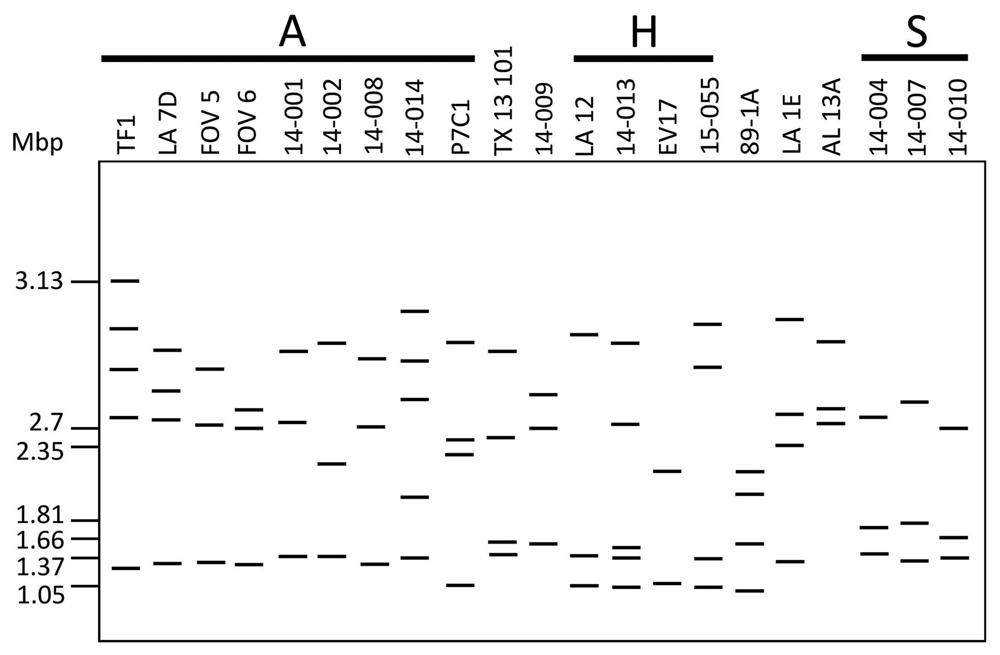

#### I. Literature Reference\

Otero et al. (2024) – *Evaluation of the Genetic Diversity, Haplotype, and Virulence of Fusarium oxysporum f. sp. vasinfectum* Field Isolates from Alabama (https://apsjournals.apsnet.org/doi/10.1094/PHYTO-11-23-0438-R)

This study revealed that the race 4 isolate 89-1A carries a set of small accessory chromosomes, including those harboring lactamase-related genes. These accessory chromosomes are postulated to contribute to the virulence of *Fusarium oxysporum* f. sp. *vasinfectum* on cotton, suggesting a potential role of horizontally transferred elements in pathogenicity.

####  II.Conclusion from the reference
```{r fig_rf4, echo=FALSE, out.width='50%', fig.align='center', results='asis'}
library(knitr)


cat("<p style='text-align: center;'>Figure 1. Small chromosome diversity in 21 <em>Fusarium oxysporum</em> f. sp. <em>vasinfectum</em> (Fov) field isolates assessed by pulsed-field gel electrophoresis.(Otero et al. 2024)</p>")
```


The race 4 isolate **89-1A** shows distinct small chromosome bands compared to other isolates. These unique chromosomes are likely accessory chromosomes and may contain virulence-associated genes, such as lactamases, contributing to increased pathogenicity on cotton.


####  III.Localizing the Genes of Interest from a Specific Accessory Chromosome

```{r cotton_gene_cluster_table, echo=FALSE, message=FALSE, warning=FALSE}
library(readr)
library(knitr)

# read data
gene_tbl <- read_csv("Location of the potential cotton specific gene cluster in CA-12.csv")

# display gene's table 
kable(gene_tbl, caption = "Location of the potential cotton-specific gene cluster\
    (Otero et al. 2024) ")
```

In **Table 1**, we identified a cluster of genes located on a specific accessory chromosome of *Fusarium oxysporum* f. sp. *vasinfectum* strain CA-12. These genes are absent in most other *F. oxysporum* strains and show high similarity to a conserved region in *Verticillium dahliae* strain Vd991.

Among the listed genes, we focused on **eight candidates** of particular interest. This selection was based on the following rationale:

1. Seven of these genes were previously reported as homologs shared between *F. oxysporum* and *V. dahliae* Vd991.
2. Our current analysis identified an **additional homolog**, expanding the set of conserved genes to eight (Chen et al., 2018).
3. These genes include **cupin, GMC oxidoreductase, GST, FMN-dependent dehydrogenase**, and multiple **SAM-dependent methyltransferases**, all of which are potentially involved in **host-specific adaptation**.
4. The presence of secretion signals and domain predictions in several genes supports their possible role as **accessory virulence factors**.
5. The entire cluster resides on a region absent from core chromosomes, suggesting its horizontal origin and role in **cotton-specific pathogenicity**.

This accessory cluster may therefore serve as a valuable genomic signature for Fov race 4 and a candidate target for disease resistance breeding in cotton.


#### VI. Localizing the Genes of Interest from a Specific Accessory Chromosome\

Based on the previous analysis, we selected **eight genes of interest** located on a putative accessory chromosome for further investigation. These genes were chosen due to their predicted functions, presence of signal peptides, and high similarity to virulence-related genes in *Verticillium dahliae*. For details, see **Table 2** below.

```{r table2_candidate_genes, echo=FALSE, message=FALSE, warning=FALSE}
library(readr)
library(dplyr)
library(knitr)

# Read Table 1 data
df <- read_csv("Location of the potential cotton specific gene cluster in CA-12.csv")

# Define the genes of interest
genes_of_interest <- c("FUN_000109", "FUN_000082", "VEDA_05193", "FUN_001654",
                       "FUN_001624", "FUN_001610", "FUN_001597", "FUN_001580", "FUN_000208")

# Filter rows containing those genes
table2 <- df %>%
  filter(sapply(`89-1A Protein`, function(x) any(grepl(paste(genes_of_interest, collapse="|"), x))))

# Show the result
kable(table2, caption = "Candidate Genes list from the Accessory Chromosome")

